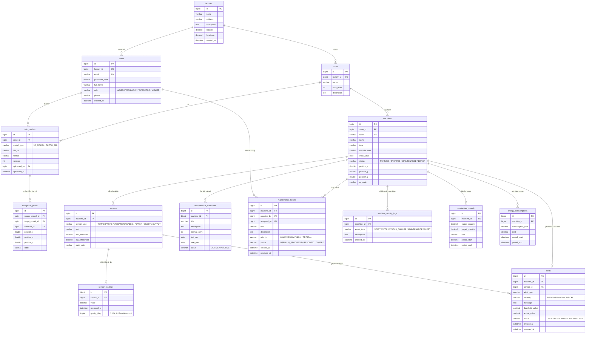
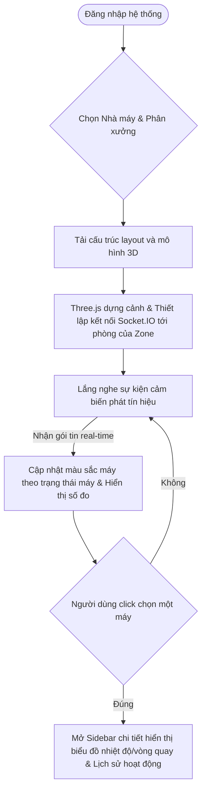
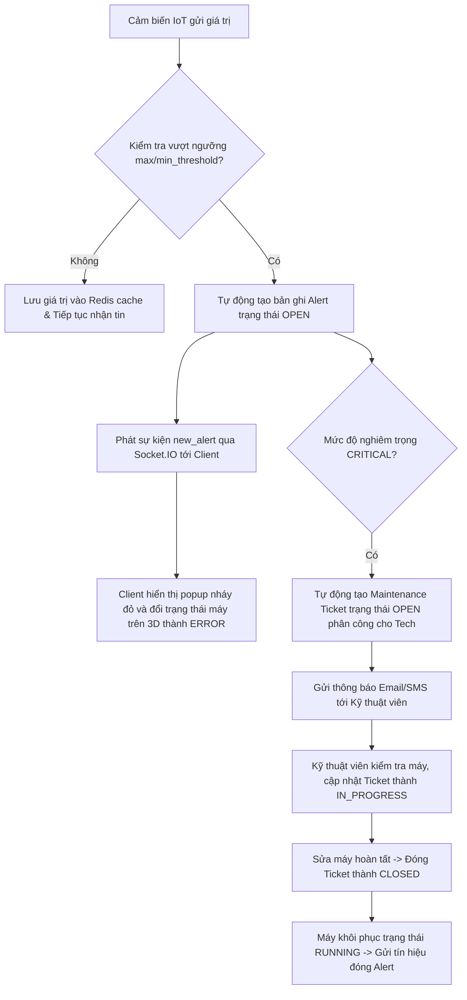

# PROPOSAL: HỆ THỐNG DIGITAL TWIN NHÀ MÁY (BÀI KIỂM TRA ĐÁNH GIÁ NĂNG LỰC)
**Ứng viên:** Lập trình viên Full Stack

**Kính gửi:** Công ty Cổ phần Giải pháp Chuyên gia Star Global

---

## 1. PHÂN TÍCH YÊU CẦU HỆ THỐNG

Nền tảng **Digital Twin Nhà máy** là sự hội tụ giữa không gian vật lý và không gian số. Mục tiêu cốt lõi là tạo ra bản sao số trực quan, kết nối luồng dữ liệu thời gian thực (Real-time IoT Telemetry) để giải quyết 3 bài toán lớn của doanh nghiệp sản xuất:
1. **Giám sát trực quan (Visualization)**: Xóa bỏ khoảng cách địa lý bằng mô hình 3D và ảnh toàn cảnh 360° tương tác cao trên môi trường Web (Next.js).
2. **Vận hành chủ động (Proactive Operation)**: Phát hiện sự cố tức thời qua hệ thống cảnh báo tự động vượt ngưỡng cảm biến và theo dõi hiệu suất OEE.
3. **Quản lý vòng đời thiết bị (Lifecycle Management)**: Số hóa quy trình bảo trì từ lên lịch định kỳ đến xử lý phiếu sự cố (Tickets).

### Các thách thức kỹ thuật lớn nhất & Hướng giải quyết:
* **Thách thức 1: Độ trễ và băng thông dữ liệu Real-time**: Hàng nghìn cảm biến gửi dữ liệu đồng thời với tần suất cao (1-2s/lần) dễ gây nghẽn kết nối và quá tải database.
  * *Giải pháp*: Kiến trúc Ingestion bất đồng bộ với hàng đợi thông điệp (Redis Queue / BullMQ) kết hợp WebSocket broadcast và bộ đệm bộ nhớ đệm (Redis Cache).
* **Thách thức 2: Hiệu suất tải mô hình 3D trên Web**: Các mô hình CAD/3D nhà máy thường rất nặng (hàng trăm MB), dễ gây giật lag hoặc treo trình duyệt.
  * *Giải pháp*: Áp dụng nén Draco, tối ưu hóa lưới đa giác (LOD), lazy loading theo khu vực và render tối ưu qua Three.js/React Three Fiber.
* **Thách thức 3: Khả năng mở rộng (Scalability)**: Số lượng bản ghi đo đạc từ cảm biến (Sensor Readings) tích lũy theo ngày/tháng sẽ lên tới hàng chục triệu dòng.
  * *Giải pháp*: Phân tách lưu trữ dữ liệu (Hot/Cold Data), sử dụng cơ chế ghi lô (Batch Inserts) và tổng hợp dữ liệu theo giờ trước khi ghi lưu trữ lâu dài.

---

## 2. THIẾT KẾ HỆ THỐNG (SYSTEM DESIGN)

### 2.1. Sơ đồ Entity-Relationship Diagram (ERD)

Dưới đây là thiết kế cơ sở dữ liệu hoàn chỉnh, chuẩn hóa thực thể và mối quan hệ để đảm bảo tính toàn vẹn dữ liệu, tối ưu hóa truy vấn trên MariaDB/MySQL.



### 2.2. Mô tả chi tiết các mối quan hệ (Database Relations)
1. **Phân cấp nhà xưởng (`Factory` - `Zone` - `Machine`)**: Mối quan hệ 1-N. Mỗi nhà máy chứa nhiều phân xưởng (Zone), mỗi phân xưởng quản lý nhiều máy móc ở các tọa độ `(position_x, y, z)` xác định trong không gian 3D.
2. **Kết nối IoT (`Machine` - `Sensor` - `SensorReading`)**: Mỗi máy có nhiều cảm biến chuyên dụng (1-N). Mỗi cảm biến sinh ra hàng loạt số đo telemetry (`SensorReading`) bất đồng bộ (1-N). Trường `quality_flag` giúp đánh giá độ tin cậy của dữ liệu đầu vào.
3. **Điểm định vị liên kết (`TwinModel` - `NavigationPoint`)**: 
   - Điểm định vị (`NavigationPoint`) thuộc về một mô hình nguồn (source).
   - Điểm này có thể liên kết đến một mô hình đích (`target_model_id` - ví dụ bấm vào cửa để chuyển cảnh) hoặc gắn kết trực tiếp với một máy móc (`machine_id` - ví dụ bấm vào pin để mở sidebar thông số máy).
4. **Vận hành & Bảo trì (`Machine` - `Alert` / `Ticket`)**:
   - Khi cảm biến vượt ngưỡng, hệ thống tự động ghi nhận một bản ghi `Alert` (1-N).
   - `Alert` nghiêm trọng có thể được chuyển đổi thủ công hoặc tự động thành một `MaintenanceTicket` giao cho Kỹ thuật viên bảo trì (`assigned_to`) xử lý.

---

### 2.3. Sơ đồ Use-Case của hệ thống

Hệ thống phân quyền chi tiết cho 4 Actor chính nhằm đảm bảo an ninh thông tin và luồng nghiệp vụ khép kín:

```mermaid
usecaseDiagram
    actor Admin as "Admin / Ban quản lý"
    actor Tech as "Kỹ thuật viên bảo trì"
    actor Operator as "Công nhân vận hành (Operator)"
    actor Viewer as "Viewer (Đối tác / Khách)"

    rectangle "Nền tảng Digital Twin Nhà máy" {
        usecase UC_Dashboard as "Xem Dashboard tổng quan & KPI"
        usecase UC_ViewTwin as "Tương tác mô hình 3D & 360°"
        usecase UC_SensorRealtime as "Giám sát thông số cảm biến Real-time"
        usecase UC_UploadModel as "Quản lý & Tải lên mô hình 3D/360°"
        usecase UC_ManageDevice as "Cấu hình Nhà máy & Thiết bị"
        usecase UC_UpdateTicket as "Tiếp nhận & Cập nhật Ticket sửa chữa"
        usecase UC_SubmitTicket as "Báo cáo sự cố máy (Tạo Ticket)"
        usecase UC_Reports as "Xem Báo cáo OEE & Điện năng tiêu thụ"
    }

    Admin --> UC_Dashboard
    Admin --> UC_ViewTwin
    Admin --> UC_SensorRealtime
    Admin --> UC_UploadModel
    Admin --> UC_ManageDevice
    Admin --> UC_Reports

    Tech --> UC_ViewTwin
    Tech --> UC_SensorRealtime
    Tech --> UC_UpdateTicket
    Tech --> UC_Reports

    Operator --> UC_ViewTwin
    Operator --> UC_SensorRealtime
    Operator --> UC_SubmitTicket

    Viewer --> UC_ViewTwin
    Viewer --> UC_SensorRealtime
```

---

### 2.4. Thiết kế User-Flow chi tiết

#### Luồng 1: Xem 3D & Giám sát Real-time IoT



#### Luồng 2: Cảnh báo bất thường & Tạo Quy trình Bảo trì



---

## 3. PHƯƠNG PHÁP TRIỂN KHAI & XỬ LÝ DỮ LIỆU REAL-TIME

### 3.1. Phân chia các giai đoạn (Phases) phát triển dự án

Để dự án được triển khai an toàn và hiệu quả, chúng tôi đề xuất mô hình Agile chia làm 4 Phase:

```
┌────────────────────────────────────────────────────────┐
│ PHASE 1: XÂY DỰNG CORE INGESTION & DATABASE (Tuần 1-4) │
├────────────────────────────────────────────────────────┤
│ - Thiết lập DB MariaDB, Redis, BullMQ.                 │
│ - Phát triển REST API & Ingestion gateway (Node.js).   │
│ - Kết nối dữ liệu giả lập từ Client IoT (MQTT/HTTP).   │
└───────────────────────────┬────────────────────────────┘
                            ▼
┌────────────────────────────────────────────────────────┐
│ PHASE 2: TƯƠNG TÁC 3D/360° DIGITAL TWIN (Tuần 5-8)     │
├────────────────────────────────────────────────────────┤
│ - Thiết lập UI Dashboard với Next.js & Tailwind CSS.   │
│ - Tích hợp React Three Fiber để render mô hình GLTF.   │
│ - Hiển thị trạng thái máy và số liệu Real-time trên 3D.│
└───────────────────────────┬────────────────────────────┘
                            ▼
┌────────────────────────────────────────────────────────┐
│ PHASE 3: QUẢN LÝ BẢO TRÌ & SỰ CỐ (Tuần 9-12)           │
├────────────────────────────────────────────────────────┤
│ - Phát triển tính năng Ticket sự cố và Lịch bảo trì.  │
│ - Hệ thống cảnh báo tự động khi cảm biến vượt ngưỡng.  │
│ - Nhật ký sự kiện hoạt động (Activity Logs).           │
└───────────────────────────┬────────────────────────────┘
                            ▼
┌────────────────────────────────────────────────────────┐
│ PHASE 4: PHÂN TÍCH CHUYÊN SÂU & TỐI ƯU (Tuần 13-16)    │
├────────────────────────────────────────────────────────┤
│ - Dashboard phân tích hiệu suất thiết bị tổng thể OEE. │
│ - Báo cáo lượng điện năng tiêu thụ theo phân xưởng.   │
│ - Tối ưu nén mô hình 3D (Draco) & Bảo trì dự đoán AI.  │
└────────────────────────────────────────────────────────┘
```

---

### 3.2. Giải pháp xử lý dữ liệu Real-time hiệu quả (Core Architecture)

Để giải quyết bài toán tải thông điệp IoT lớn mà không làm sập Database, chúng tôi đề xuất kiến trúc **Luồng dữ liệu 4 lớp (4-Layer Ingestion Pipeline)**:

```
[ THIẾT BỊ CẢM BIẾN ]
      │ (Tần suất 1-2s)
      ▼
 ┌─────────┐
 │ Layer 1 │ Ingestion Gateway (Node.js REST / MQTT Broker như EMQX)
 └────┬────┘
      │
      ├──────────────────────────┐ (Publish ngay lập tức)
      ▼                          ▼
 ┌─────────┐                ┌─────────┐
 │ Layer 2 │ Redis Cache    │ Layer 2 │ BullMQ (Redis Queue)
 └────┬────┘ (Lưu số đo gần  └────┬────┘ (Xử lý hàng đợi bất đồng bộ)
      │       nhất để đọc)       │
      ▼                          ▼
 ┌─────────┐                ┌─────────┐
 │ Layer 3 │ WebSocket      │ Layer 3 │ Worker Process (Node.js)
 └────┬────┘ (Socket.IO          └────┬────┘ (Gom 100 bản ghi insert 1 lần)
      │       phát Client)       │
      ▼                          ▼
 ┌─────────┐                ┌─────────┐
 │ Layer 4 │ Trình duyệt    │ Layer 4 │ MariaDB (Lưu trữ lịch sử)
 └─────────┘ (Vẽ biểu đồ)   └─────────┘
```

1. **Lớp Tiếp nhận (Ingestion Gateway)**: Nhận dữ liệu telemetry từ cảm biến qua HTTP POST hoặc giao thức MQTT nhẹ hơn.
2. **Lớp Đệm (Caching & Queueing)**:
   * **Redis Cache**: Lưu trữ ngay giá trị mới nhất của cảm biến (`sensor:id:latest`) với thời gian hết hạn thích hợp. Nhờ vậy, Client Next.js khi cần lấy giá trị hiện tại của máy sẽ đọc trực tiếp từ Redis trong **O(1)**, hoàn toàn không chạm vào ổ đĩa cứng của MariaDB.
   * **BullMQ (Redis Queue)**: Đưa số đo vào hàng đợi tạm thời để xử lý bất đồng bộ. Điều này giúp hệ thống chống chịu được các thời điểm dữ liệu tăng đột biến (traffic spikes).
3. **Lớp Xử lý (Worker Layer)**:
   * Một worker chuyên biệt sẽ đọc dữ liệu từ BullMQ và thực hiện **Batch Insert** (Gom nhóm ví dụ 100-500 dòng ghi một lần bằng `createMany`), giảm số lượng kết nối ghi đĩa đến MariaDB từ 100 xuống còn 1.
4. **Lớp Phát sóng (WebSockets)**:
   * Đồng thời, Gateway phát sự kiện qua kênh Redis Pub/Sub. Server Socket.IO nhận thông điệp và truyền trực tiếp xuống các Client đang kết nối xem phân xưởng đó trong thời gian thực dưới `< 100ms`.

---

## 4. CÁC GIẢI PHÁP VÀ ĐỀ XUẤT BỔ SUNG

### 4.1. Giải pháp tối ưu hóa render mô hình 3D trên Web
* **Draco Compression**: Nén hình học mô hình 3D `.glb`/`.gltf` giúp giảm kích thước tệp từ 70-80% mà không giảm chất lượng hiển thị trực quan.
* **Level of Detail (LOD)**: Thiết lập camera của Three.js. Khi camera ở xa, render mô hình đơn giản ít đa giác; khi camera tiến sát gần máy móc, tự động nâng cấp render mô hình độ phân giải cao chi tiết.
* **Texture Compression (KTX2 / Basis Universal)**: Giảm dung lượng VRAM tiêu thụ của GPU thiết bị người dùng, ngăn ngừa lỗi tràn bộ nhớ (Out of Memory) trên các thiết bị di động cấu hình trung bình.

### 4.2. Bảo trì dự đoán bằng trí tuệ nhân tạo (AI Predictive Maintenance)
* Không chỉ dừng lại ở cảnh báo vượt ngưỡng tĩnh (Static Thresholds), hệ thống sẽ tích hợp mô hình máy học **LSTM (Long Short-Term Memory)** để phân tích chuỗi thời gian của các cảm biến nhiệt độ và độ rung.
* Mô hình AI sẽ phát hiện các xu hướng bất thường nhỏ (Anomalies) tích lũy dần theo tuần – dấu hiệu của việc mài mòn vòng bi hoặc thiếu dầu bôi trơn – và tự động đề xuất lịch bảo trì trước khi xảy ra hư hỏng thực tế khoảng 3-5 ngày.

### 4.3. Tích hợp thực tế tăng cường (AR) cho đội kỹ thuật hiện trường
* Tạo mã QR độc bản cho mỗi máy móc và dán trực tiếp lên vỏ máy ngoài thực tế.
* Kỹ thuật viên bảo trì chỉ cần dùng thiết bị di động quét mã QR, trình duyệt web Next.js sẽ kích hoạt camera và sử dụng thư viện **WebXR** để hiển thị các thông số cảm biến thời gian thực, sơ đồ mạch điện và tài liệu hướng dẫn sửa chữa đè trực tiếp (Overlay) lên máy móc thực tế dưới dạng 3D AR.

### 4.4. Dashboard Analytics & Tính toán chỉ số OEE tự động
* Hệ thống tự động tính toán chỉ số **Hiệu suất thiết bị tổng thể (OEE - Overall Equipment Effectiveness)** theo thời gian thực dựa trên 3 nhân tố:
  $$\text{OEE} = \text{Mức độ sẵn sàng (Availability)} \times \text{Hiệu suất vận hành (Performance)} \times \text{Mức độ chất lượng (Quality)}$$
* Dữ liệu OEE này kết hợp với biểu đồ thống kê năng lượng tiêu thụ (kWh) giúp Ban giám đốc đánh giá hiệu suất năng lượng trên mỗi đơn vị sản phẩm được sản xuất ra, từ đó tối ưu hóa chi phí sản xuất và hướng tới mục tiêu nhà máy thông minh phát thải xanh (Green Factory).
